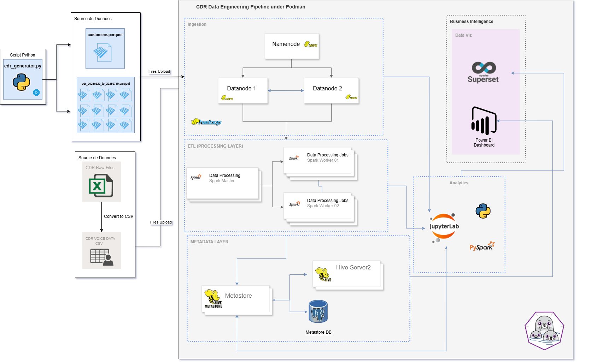
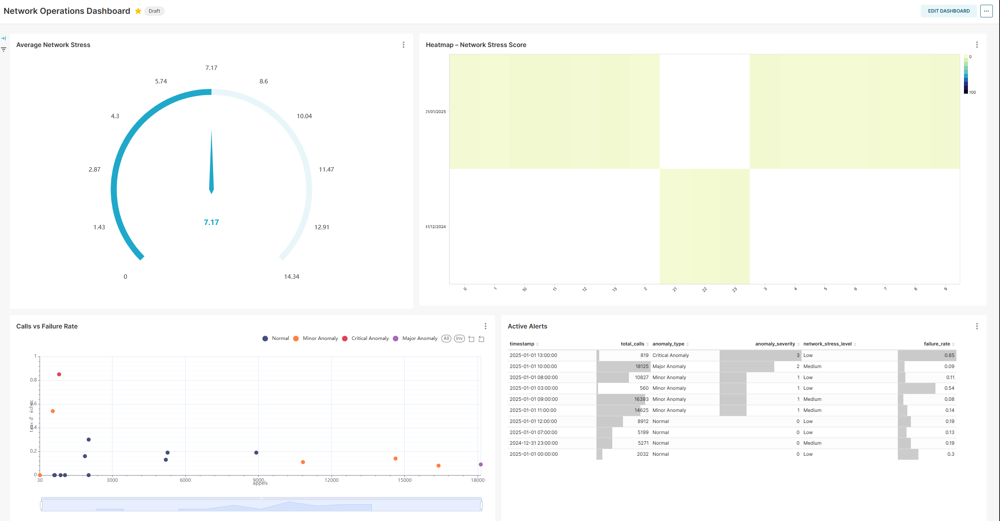
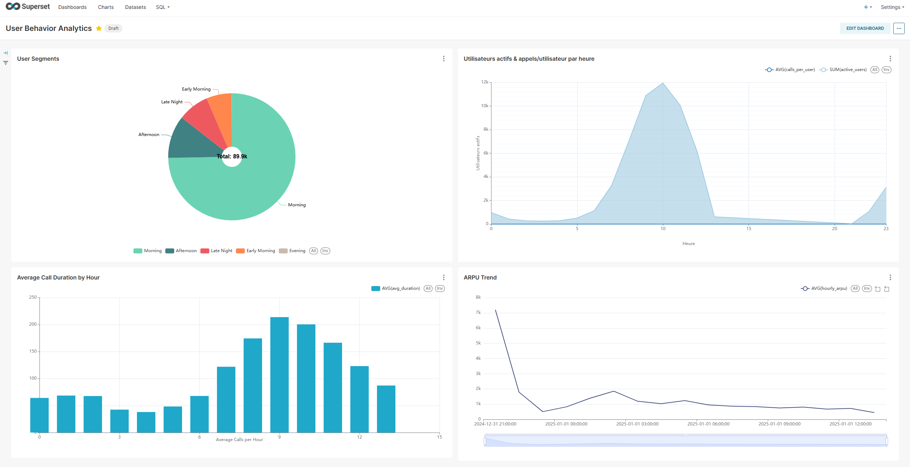
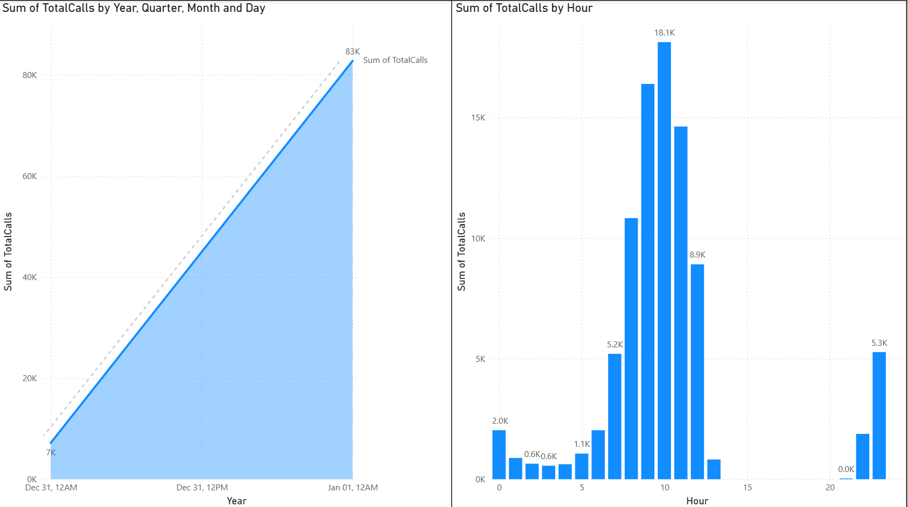
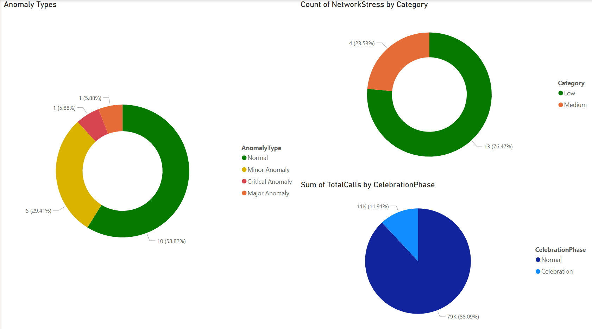
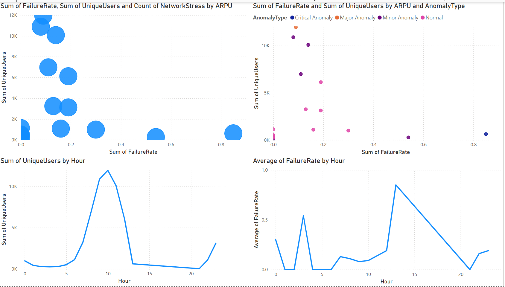

# CDR Telecom Big Data Platform

# CDR Telecom Big Data Platform

**Final-Year Internship • Algérie Télécom • July 2025**

An end-to-end, containerized **batch** & **streaming** pipeline for CDR processing and analysis, built with Podman, HDFS, JupyterLab, Hive, Spark, Kafka, Flink, Superset/Power BI, Grafana, Prometheus & AlertManager.  
_Working in WSL2 with Podman in a Python venv. Streaming live; Airflow & Great Expectations coming soon._

---

## 🔍 Overview

- **Real Telecom Data Sample**: ingest FTTH/ADSL/4G-LTE CDR voice logs → EDA → Hive tables → transformations → BI  
- **Safe-by-Design CDRs**: realistic generator with data-quality checks  
- **PII-Anonymized**: SHA-256 hashing of customer IDs  
- **Star Schema**: one `customer` dim + usage & billing fact tables  
- **EDA & QC**: Jupyter notebooks for stats, missing‐value handling & outlier filtering  
- **Hive Tables**: automated DDL & partitioned zones (raw → clean → analytics)  
- **Feature Engineering**: hourly aggregates & service-trend metrics  
- **Network Trends & Anomalies**: Spark batch jobs + Flink streaming alerts  
- **BI & Exports**: Superset & Power BI dashboards + export notebooks  
- **Streaming Stack**: Zookeeper → 3 × Kafka → Kafka-UI → Flink → Prometheus/Grafana → Postgres sink  
- **CDR Producer**: live Kafka producer service  
- **Jupyter Environment**: custom Spark image (Python 3.10 + notebook libs)

---

## 🏗️ Architecture

<center>



</center>

- **Custom Hybrid**  
  - **Batch** (Spark → Hive) for analytics  
  - **Streaming** (Kafka → Flink) for real-time alerts  
  - **No serving layer yet**—analytics & alerts separate  
- **Lambda-Ready**: can add a serving layer to merge batch & speed views later

---

## ⚙️ Tech Stack

| Layer         | Tools & Versions                                |
|---------------|-------------------------------------------------|
| **Storage**   | Hadoop 3.3.6, Hive 4.0.0 (Postgres metastore)   |
| **Batch**     | Spark 3.5.1                                     |
| **Streaming** | Kafka 7.6.0, Flink 1.18.1                       |
| **Container** | Podman Compose (WSL2, Python venv)              |
| **Notebook**  | Custom Spark image (Python 3.10, JupyterLab, PySpark, libraries) |
| **BI & Dash** | Superset 3.0.4, Power BI Desktop                |
| **Monitoring**| Prometheus, Grafana                             |
| **Dev**       | JupyterLab, Python 3.9+                         |

---

## 📂 Repo Structure

```text
network_trend_analysis/
├── docker-compose-batch.yml # HDFS, Hive, Spark, JupyterLab, Superset, Airflow, 
├── data /
├── batch /
│ ├── hadoop /
│ │ ├── config /
│ │ ├── namenode /
│ │ ├── datanode1 /
│ │ ├── datanode2   /
│ ├── Hive /
│ │ ├── config /
│ │ │ │── postgresql-42.7.2.jar
│ │ ├── hive-site.xml
│ ├── Jupyter /
│ │ ├── Dockerfile  # Build custom Spark + Python 3.10 Jupyter image
│ │ ├── notebooks /
│ │ │ │── work /
│ │ │ │ │── scripts /
│ │ │ │ │ │── spark_init.py 
│ │ │ │ │── spark-apps /
│ │ │ │ │ │── 01_Data_Ingestion_Validation.ipynb
│ │ │ │ │ │── 02_Customer_Dimension_Analysis.ipynb.ipynb
│ │ │ │ │ │── 03_Hive_Tables_Creation.ipynb
│ │ │ │ │ │── 04 CDR_Exploratory_Analysis.ipynb
│ │ │ │ │ │── 05_Data_Transformations_Engineering.ipynb
│ │ │ │ │ │── 06_Anomaly_Detection_Engineering.ipynb.ipynb
│ │ │ │ │ │── 07_Trend_Analysis_Forecasting.ipynb.ipynb
│ │ │ │ │ │── 08_Network_Performance_Analytics.ipynb
│ │ │ │ │ │── 09_Business_Intelligence_Metrics.ipynb
│ │ │ │ │ │── 10_PowerBI_Data_Preparation.ipynb
│ │ │ │ │ │── 10_Superset_Data_Preparation.ipynb
│ │ │ │ │── dashboards /
│ │ │ │ │ │── exports / 
│ │ │ │ │ │── exports.zip
│ ├── spark /
│ │ ├── config /
│ │ │ │── spark-defaults.conf 
│ ├── uml /
│ │ │ │── use_case_diagram.puml
│ │ │ │── class_diagram.puml
│ │ │ │── sequence_elt_diagram.puml
├── streaming /
│ ├── .venv/ 
│ ├── flink/ # Flink SQL jobs
│ │ │ │── cdr_flink_job.py
│ ├── kafka/ # CDR & Kafka producer
│ │ │ │── producer / 
│ │ │ │── consumer /  
│ └── monitoring/ 
│ │ │ │── config /
│ │ │ │ │── jmx-exporter-broker1.yml
│ │ │ │ │── jmx-exporter-broker2.yml
│ │ │ │ │── jmx-exporter-broker3.yml
│ │ │ │── grafana /
│ │ │ │ │── dashboards / 
│ │ │ │ │ │── files / 
│ │ │ │ │ │── dashboard-provisioning.yml
│ │ │ │ │── datasources / 
│ │ │ │── prometheus /
│ │ │ │ │── alertmanager /
│ │ │ │ │── rules /
│ │ │ │ │── prometheus.yml
└── docs/ # Design docs & report
│ └── README.md                    # Architecture docs & 
```

 ## 🚀 How to Download & Run

#### 1. Clone the repo

```bash
git clone https://github.com/your-org/cdr-telecom-bigdata-platform.git

cd cdr-telecom-bigdata-platform
```

#### 2. Start all Batch services and Build Jupyter image

```bash
cd batch 
podman-compose -f batch/docker-compose-batch.yml up -d
 
```

#### 3. Start streaming services

```bash
cd streaming 
podman-compose -f docker-compose-streaming.yml up -d
```


#### 3. Start streaming services

```bash
cd streaming 
podman-compose -f docker-compose-streaming.yml up -d
```


#### 4. Generate & ingest CDRs (Batch)

```bash
cd cdr-data-generator/Python-CDR-Generator
python3 cdr_at_data_generator.py \
  --config ./resources/at_config.json \
  --batch-days 3
podman-compose -f docker-compose-streaming.yml up -d

#access Namenode Container 
podman exec -it namenode bash

#inside the container Namenode
hdfs dfs -mkdir -p /data/Raw/generated_at_cdr_enhanced

hdfs dfs -put /mnt/generated_at_cdr_enhanced_fixed/*  /data/Raw/generated_at_cdr_enhanced/
```


To double-check the exact flag names, you can run:
```bash
python3 cdr_at_data_generator.py --help
```


#### 5. Generate & ingest CDRs (Streaming)

```bash
cd streaming/kafka/producer
python3 cdr_stream_gen.py \
  --config streaming_config.json \
```

Check Kafka UI : localhost:8085

#### 📡 Check UIs Service Endpoints

| Service               | URL                          |
|-----------------------|------------------------------|
| **HDFS NameNode UI**  | http://localhost:9870        |
| **Spark Master**      | http://localhost:8080        |
| **Spark Worker 1**    | http://localhost:8081        |
| **Spark Worker 2**    | http://localhost:8082        |
| **JupyterLab**        | http://localhost:8888        |
| **Superset**          | http://localhost:8088        |
| **Airflow**           | http://localhost:8070        |
| **Kafka UI**          | http://localhost:8085        |
| **Flink JobManager**  | http://localhost:8081        |
| **Grafana**           | http://localhost:3000        |
| **Prometheus**        | http://localhost:9090        |
| **AlertManager**      | http://localhost:9093        |
| **Postgres Exporter** | http://localhost:9187        |
| **Kafka Exporter**    | http://localhost:9308        |
| **JMX Exporter 1**    | http://localhost:5556        |
| **JMX Exporter 2**    | http://localhost:5557        |
| **JMX Exporter 3**    | http://localhost:5558        |

### 📊 Sample Dashboards

#### Superset Dashboards Overview 





#### Power BI Dashboards Overview 






### 🚧 Roadmap

- ✅ Batch ETL & Hive integration

- ✅ Streaming stack & live CDR producer

- 🚧 Apache Airflow orchestration

- 🚧 Great Expectations for data-quality tests

### 🤝 Contributing

1. Fork & create a feature branch

2. Add tests, docs or code

3. Submit a pull request

### 📄 License
Apache 2.0 © Zakaria Alizouaoui